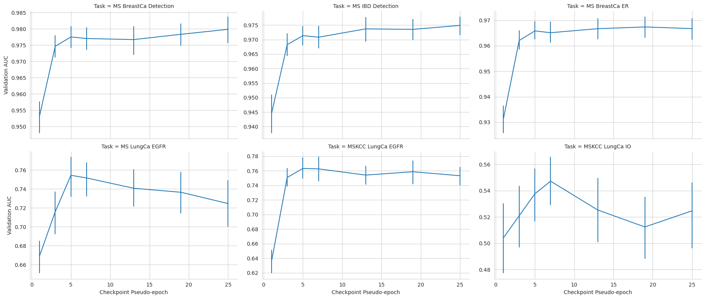

# A Clinical Benchmark of Public Self-Supervised Pathology Foundation Models

Repository of training recipes for the manuscript: "A Clinical Benchmark of Public Self-Supervised Pathology Foundation Models".
Manuscript link: [arxiv](https://arxiv.org/abs/2407.06508)

## Abstract
The use of self-supervised learning (SSL) to train pathology foundation models has increased substantially in the past few years. Notably, several models trained on large quantities of clinical data have been made publicly available in recent months. This will significantly enhance scientific research in computational pathology and help bridge the gap between research and clinical deployment. With the increase in availability of public foundation models of different sizes, trained using different algorithms on different datasets, it becomes important to establish a benchmark to compare the performance of such models on a variety of clinically relevant tasks spanning multiple organs and diseases. In this work, we present a collection of pathology datasets comprising clinical slides associated with clinically relevant endpoints including cancer diagnoses and a variety of biomarkers generated during standard hospital operation from two medical centers. We leverage these datasets to systematically assess the performance of public pathology foundation models and provide insights into best practices for training new foundation models and selecting appropriate pretrained models.

## Clinically Relevant Downstream Tasks

| Task      | Origin | Disease           | Slides | Scanner           |
| --------- | ------ | -------------     | -----: | ----------------- |
| Detection | MSHS   | Breast Cancer     | 1,998  | Philips Ultrafast |
| Detection | MSHS   | Oral Cancer       |   279  | Philips Ultrafast |
| Detection | MSHS   | Bladder Cancer    |   448  | Philips Ultrafast |
| Detection | MSHS   | Kidney Cancer     | 1,000  | Philips Ultrafast |
| Detection | MSHS   | Thyroid Cancer    |   710  | Philips Ultrafast |
| Detection | MSHS   | DCIS              |   233  | Philips Ultrafast |
| Detection | MSHS   | Prostate Cancer   | 1,000  | Philips Ultrafast |
| Detection | MSHS   | Colorectal Cancer |   413  | Philips Ultrafast |
| Detection | MSHS   | IBD               | 1,448  | Philips Ultrafast |

| Task      | Origin | Biomarker     | Specimen      | Slides | Scanner           |
| --------- | ------ | ------------- | ------------- | -----: | ----------------- |
| Biomarker | MSHS   | IHC ER        | Breast Cancer | 2,000  | Philips Ultrafast |
| Biomarker | MSHS   | IHC PR        | Breast Cancer | 1,986  | Philips Ultrafast |
| Biomarker | MSHS   | IHC/FISH HER2 | Breast Cancer | 2,018  | Philips Ultrafast |
| Biomarker | MSHS   | BioMe HRD     | Breast        |   563  | Philips Ultrafast |
| Biomarker | MSHS   | NGS EGFR      | LUAD          |   294  | Philips Ultrafast |
| Biomarker | MSKCC  | NGS EGFR      | LUAD          | 1,000  | Aperio AT2        |
| Biomarker | MSKCC  | NGS ALK       | LUAD          |   999  | Aperio AT2        |
| Biomarker | MSKCC  | NGS STK11     | LUAD          |   998  | Aperio AT2        |
| Biomarker | MSKCC  | NGS KRAS      | LUAD          |   998  | Aperio AT2        |
| Biomarker | MSKCC  | NGS TP53      | LUAD          |   998  | Aperio AT2        |
| Outcome   | MSKCC  | ICI Response  | NSCLC         |   454  | Aperio AT2        |

MSHS: Mount Sinai Health System
DCIS: Ductal Carcinoma In Situ
IBD: Inflammatory Bowel Disease
ER: Estrogen Receptor
PR: Progesterone Receptor
IHC: Immunohistochemistry
FISH: Fluorescence In Situ Hybridization
MSKCC: Memorial Sloan Kettering Cancer Center
LUAD: Lung Adenocarcinoma
ICI: Immene Checkpoint Inhibitors
NSCLC: Non-Small Cell Lung Cancer

## Public Pathology Foundation Models

| Model                                                               | Param. (M) | Algorithm | Training Data | Tiles (M) | Slides (K) |
| ------------------------------------------------------------------- | ---------: | --------- | ------------- | --------: | ---------: |
| [CTransPath](https://github.com/Xiyue-Wang/TransPath)               |         28 | SRCL      | TCGA, PAIP    |        16 |         32 |
| [Phikon]()                                                          |         86 | iBOT      | TCGA          |        43 |          6 |
| [UNI](https://huggingface.co/MahmoodLab/UNI)                        |        303 | DINOv2    | MGB           |       100 |        100 |
| [Virchow](https://huggingface.co/paige-ai/Virchow)                  |        631 | DINOv2    | MSKCC         |     2,000 |      1,488 |
|                                                                 |         22 | DINO      | MSHS          |     1,600 |        423 |
|                                                                 |         86 | DINO      | MSHS          |     1,600 |        423 |
| [Prov-GigaPath](https://huggingface.co/prov-gigapath/prov-gigapath) |      1,135 | DINOv2    | PHS           |     1,300 |        171 |

MGB: Mass General Brigham
MSKCC: Memorial Sloan Kettering Cancer Center
MSHS: Mount Sinai Health System
PHS: Providence Health and Services

## Detection Benchmarks

## Biomarker Benchmarks

