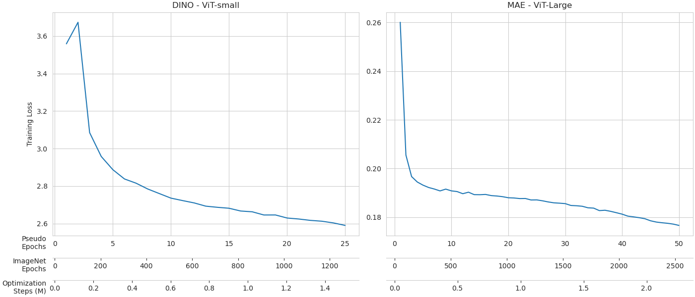
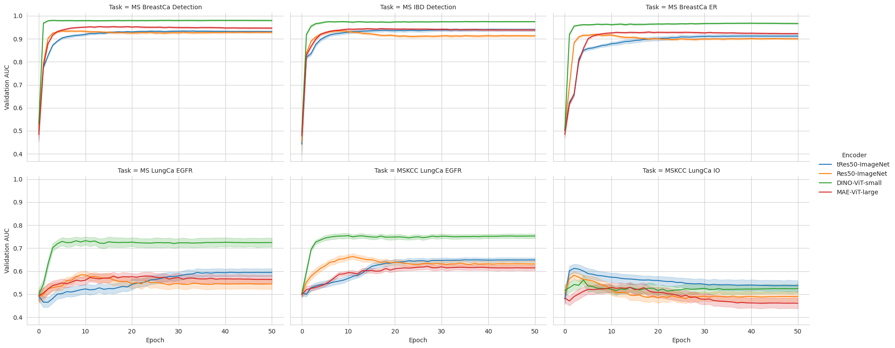
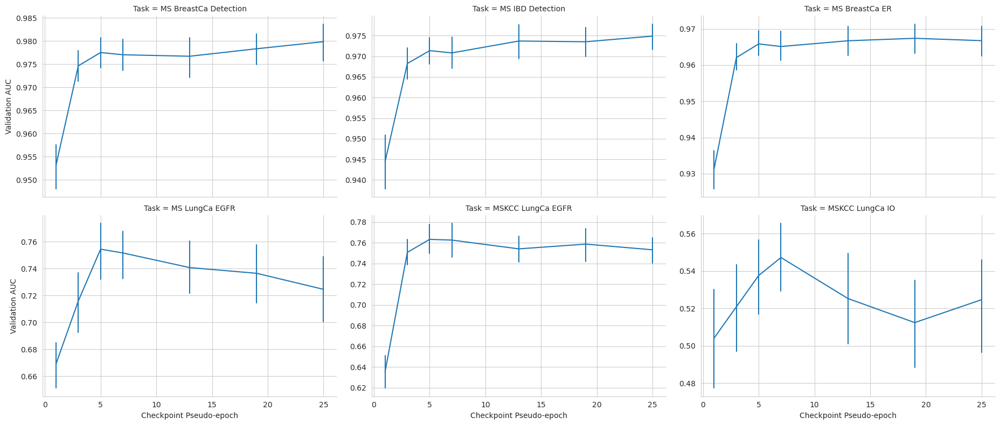

# Self-Supervised Learning Benchmarks

Repository of training recipes for the manuscript: "Computational Pathology at Health System Scale - Self-Supervised Foundation Models from Three Billion Images".
Manuscript link: [arxiv](https://www.google.com)

## Abstract
Recent breakthroughs in self-supervised learning have enabled the use of large unlabeled datasets to train visual foundation models that can generalize to a variety of downstream tasks. While this training paradigm is well suited for the medical domain where annotations are scarce, large-scale pre-training in the medical domain, and in particular pathology, has not been extensively studied. Previous work in self-supervised learning in pathology has leveraged smaller datasets for both pre-training and evaluating downstream performance. The aim of this project is to train the largest academic foundation model and benchmark the most prominent self-supervised learning algorithms by pre-training and evaluating downstream performance on large clinical pathology datasets. We collected the largest pathology dataset to date, consisting of over 3 billion images from over 423 thousand microscopy slides. We compared pre-training of visual transformer models using the masked autoencoder (MAE) and DINO algorithms. We evaluated performance on six clinically relevant tasks from three anatomic sites and two institutions: breast cancer detection, inflammatory bowel disease detection, breast cancer estrogen receptor prediction, lung adenocarcinoma EGFR mutation prediction, and lung cancer immunotherapy response prediction. Our results demonstrate that pre-training on pathology data is beneficial for downstream performance compared to pre-training on natural images. Additionally, the DINO algorithm achieved better generalization performance across all tasks tested.  The presented results signify a phase change in computational pathology research, paving the way into a new era of more performant models based on large-scale, parallel pre-training at the billion-image scale.

## Clinically Relevant Downstream Tasks

| Cohort                                   | Origin | Task      | Disease       | Slides | Scanner           |
| ---------------------------------------- | ------ | --------- | ------------- | -----: | ----------------- |
| Breast Cancer Detection                  | MSHS   | Detection | Breast Cancer | 1,998  | Philips Ultrafast |
| Breast Cancer ER Prediction              | MSHS   | Biomarker | Breast Cancer | 2,000  | Philips Ultrafast |
| IBD Detection                            | MSHS   | Detection | IBD           | 1,448  | Philips Ultrafast |
| Lung Adenocarcinoma EGFR Prediction      | MSHS   | Biomarker | LUAD          | 294    | Philips Ultrafast |
| Lung Adenocarcinoma EGFR Prediction      | MSKCC  | Biomarker | LUAD          | 1,000  | Aperio AT2        |
| Non-Small Cell Lung Cancer IO Prediction | MSKCC  | Outcome   | NSCLC         | 454    | Aperio AT2        |

ER: Estrogen Receptor;
MSHS: Mount Sinai Health System;
MSKCC: Memorial Sloan Kettering Cancer Center;
IBD: Inflammatory Bowel Disease;
LUAD: Lung Adenocarcinoma;
NSCLC: Non-Small Cell Lung Cancer;
IO: Immuno-Oncology

## Training Recipes

### `torch` Dataset Class

The main deviation to the original repositories is the definition of the `torch` dataset class. We included argument `root` which indicates the directory where the hardcoded tile schedules are stored. The class also has a method `makedata` which expects the parameter `epoch` that should be called at the beginning of each epoch. Hardcoded tile schedules can be as simple as a DataFrame with a single column (named `imgpath` in the example below) pointing to the tile file.
```python
import os
import numpy as np
import pandas as pd
import torch
import torch.utils.data as data
from PIL import Image

def load_data(epoch, root=''):
    '''
    Loading epoch-based tile schedule from file
    '''
    data = pd.read_csv(os.path.join(root, f'slide_schedule_{epoch}.csv'))
    return data

class ssl_dataset(data.Dataset):
    def __init__(self, transform=None, root=''):
        '''
	root: new argument, indicates the directory where the hardcoded tile schedules are stored
	'''
        self.root = root
        self.df = None
        self.transform = transform

    def makedata(self, epoch):
        '''
	This function is called at the beginning of each epoch. It loads the hardcoded tile schedule for that epoch
	'''
        self.df = load_data(epoch, root=self.root)

    def __getitem__(self, index):
        row = self.df.iloc[index]
        img = Image.open(row.imgpath).convert('RGB')
        if self.transform is not None:
            img = self.transform(img)
        return img

    def __len__(self):
        return len(self.df)
```

### DINO ViT-small

```python
main_dino.py --arch vit_small\
             --batch_size_per_gpu 90\
             --num_workers 10\
             --output_dir <path to output directory>\
             --epochs 50\
	     --out_dim 65536\
	     --warmup_teacher_temp 0.04\
	     --teacher_temp 0.04\
	     --warmup_teacher_temp_epochs 1\
	     --weight_decay 0.04\
	     --weight_decay_end 0.4\
	     --freeze_last_layer 1\
	     --warmup_epochs 1\
	     --lr 0.00005\
	     --clip_grad 1.0\
	     --use_fp16 False\
	     --saveckp_freq 2\
	     --root <path to root directory where jpeg images are stored, not a standard parameter>
```
If a parameter is missing from above, the default was used.

### MAE ViT-large

```python
main_pretrain.py --model mae_vit_large_patch16\
		 --batch_size 180\
		 --num_workers 10\
		 --output_dir <path to output directory>\
		 --log_dir <path to output directory>\
		 --epochs 50\
		 --warmup_epochs 5\
		 --blr 0.0001\
		 --weight_decay 0.05\
		 --norm_pix_loss\
		 --root <path to root directory where jpeg images are stored, not a standard parameter>
```
If a parameter is missing from above, the default was used.

## Results

### Self-Supervised Pre-training and Baselines

Self-Supervised Models:
* ViT-small (21.7M parameters, 384 features) trained with DINO ([GitHub Repository](https://github.com/facebookresearch/dino))
* ViT-large (303.3M parameters, 1024 features) trained with MAE ([GitHub Repository](https://github.com/facebookresearch/mae))


Baselines:
* Truncated ResNet50 (8.5M parameters, 1024 features) pre-trained on ImageNet
* ResNet50 (23.5M parameters, 2048 features) pre-trained on ImageNet

### Downstream Task Training

To asses downstream task performance we extract features from encoders and train a gated MIL attention (GMA) model to aggregate tiles over a slide. GMA training was performed using  20 rounds of Monte Carlo Cross-Validation (MCCV). Overall, the DINO-ViT-small model outperformed other training strategies.


### DINO ViT-small Checkpoints

Downstream performance of the ViT-small model during the DINO pre-training.

